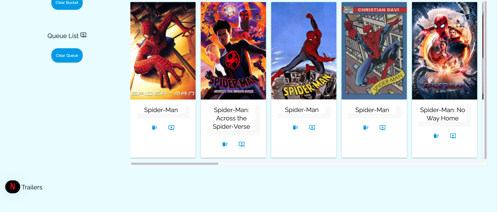
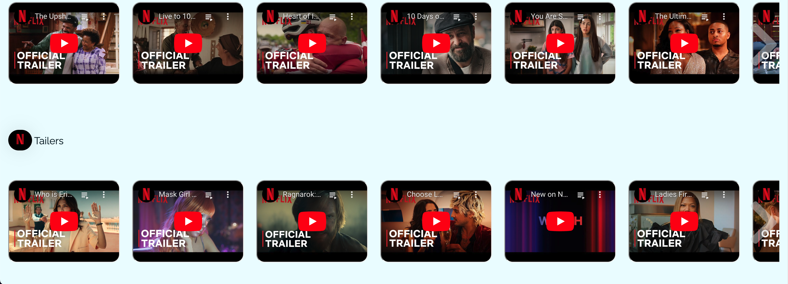

# Cine-Search

This is an app that enables users to search movies by title or filter out a list of movies based on preference,
view trailers and description, and add movies to a bucket and queue list.

## Link to Deployed Application
<a href="https://team-ccmy.github.io/Cine-Search/">CineSearch</a>

## Description
- This web application is designed to simplify the movie discovery process for users.
- This web application provides movie filters and a search function for queries.
- When movies are loaded, users can click on each to view the description of the movie.
- When movies are loaded, users can click on buttons on the movie to add their favourite movies to a bucket list or a queue list.
- Every search query is logged to make it easier for user to backtrack their search.
- Users can easily clear search history, bucket list, or queue list with buttons.
- At the bottom of the page, users can find recommended movie trailers.

## Installation

N/A

## Usage
- Users can enter the movie title into the search box and press 'Enter' or the search button and the movies corresponding to the search will load alongside a themed trailer.
- Users can select filters and press 'Enter' or the search button and the movies corresponding to the filter selection will load.
- Users can click on any loaded movie to view a more detailed description of the selected movie.
- Users can click on the designated buttons in the loaded movie to add to bucket list or queue list for later viewing.
- Usrs can view their past searches under 'search history' and click on the movie title in the history to load the corresponding movies again.
- Users can click on the clear buttons at the bottom of the search history, bucket list, and queue list sections to clear each list individually.
- Users can scroll down to the bottomo of the page to view some default recommended movie trailers if they are still undecided.
- Users can click on the toggle button near the header to change the theme of the website from light to dark.

## Screenshot of the Website

## Credits

N/A